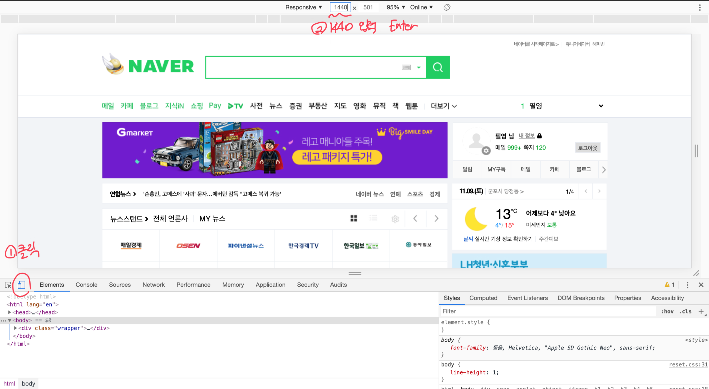

# NAVER clone

- 포털사이트 네이버의 메인페이지 정적요소(HTML,CSS)를 직접 구현하였습니다.
- 웹 페이지 레이아웃 구현 연습 및 학습을 위해 , 네이버 메인페이지를 모델로 삼아 실습하였습니다.
- `MAC기반 환경`에서 작업하였고 , `chrome 브라우저`를 통해 구현 확인하였습니다.
- 15인치, 가로 1440px 이상 혹은 이하에서는 이미지가 깨져 보일 수 있습니다. (크롬브라우저 개발자도구 반응형 탭을 통해 확인가능합니다.)
- 
- 이미지 출처 - www.naver.com 

## Stack

- HTML
- CSS
- JS

## Contributions

코드에 대한 모든 피드백은 환영하고 감사합니다 . 

## Contact

- pilyeooong@gmail.com 

- 이 저장소 및 소스들은 오로지 `개인 스터디 목적`으로 작성되었습니다. 

